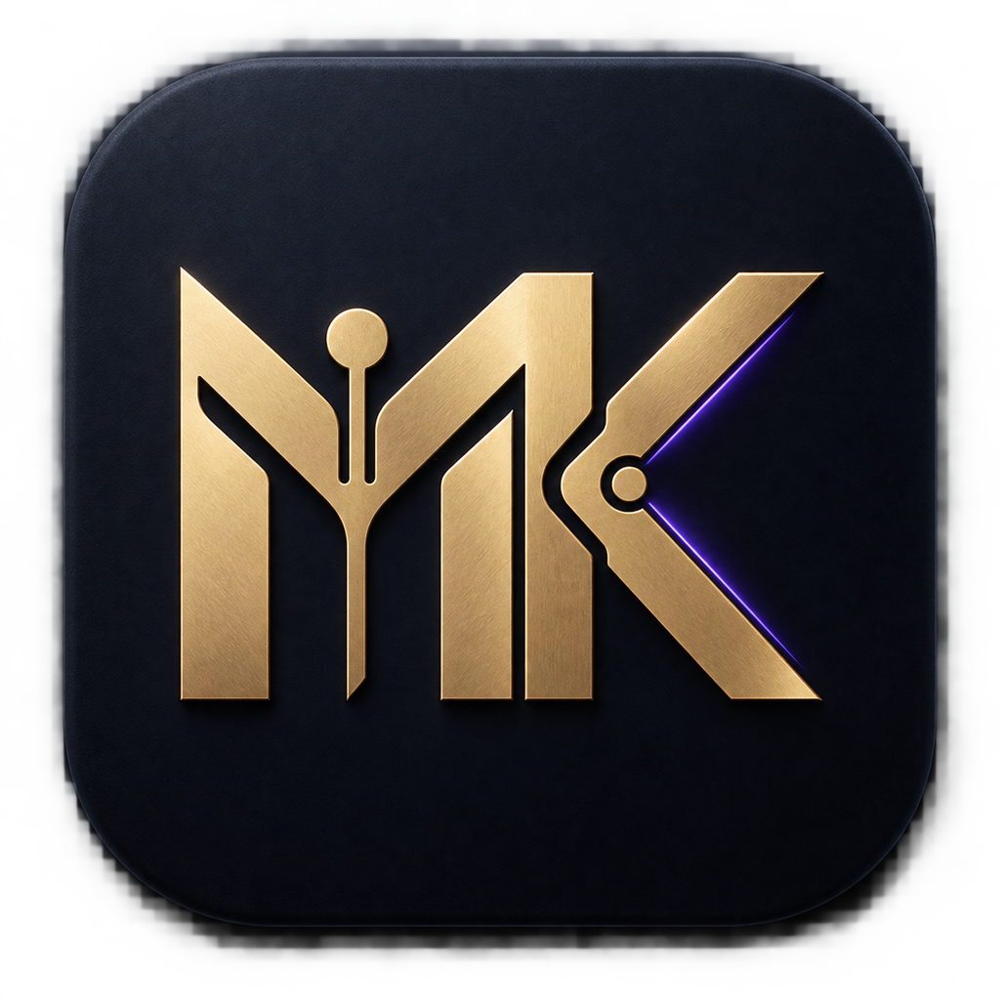

# Agent Model Connect (APIson) — 多模型调度与助手委派平台



## 第一次打开

- **Windows**：双击 **`打开 APIson.bat`**。需要桌面图标时，再双击 **`创建 Windows 桌面快捷方式.bat`**。
- **macOS**：双击 **`APIson.app`**，也可以双击 **`打开 APIson.command`**。
- **Linux**：运行一次 **`./安装 Linux 桌面快捷方式.sh`** 加入应用菜单，也可以双击 `APIson.desktop`。

看到带金色 **MK** 图标的窗口，就表示打开的是 APIson 管理面板。

用于给你的各类 AI Agent（Antigravity、Cursor、Claude Code、Codex CLI、Dify、Cline、Trae 等）统一接入与调度外部大模型池（火山引擎方舟、DeepSeek、阿里百炼、智谱、Kimi、硅基流动、Claude 3.7、Gemini 2.5、OpenAI、Grok、OpenRouter、本地 Ollama 等）。

主 Agent 保持原有工作流不变，遇到复杂代码、长文本、重度推理或特定专长任务时，可将子任务**安全委派**给外部助手模型或子代理（Subagents）执行。

---

## 🖥️ 可视化管理窗口 (GUI)

支持 macOS、Windows 及 Linux 跨平台运行：

### 启动方式：
1. **macOS / Linux 一键启动**（首次运行自动创建 `.venv` 并安装依赖）：
   ```bash
   chmod +x start_gui.sh
   ./start_gui.sh
   ```
2. **Windows 一键启动**（首次运行自动创建 `.venv` 并安装依赖）：
   双击根目录下的 `启动模型管理器.bat` 或 `start_gui.bat`。
   启动本地网关使用 `start_gateway.bat`。
3. **命令行通用启动**：
   ```bash
   python bootstrap.py gui
   python bootstrap.py gateway
   ```

运行要求：Python 3.10 或更高版本。Windows 同时支持 `py -3` 和 `python` 命令。虚拟环境不能跨操作系统复制；APIson 会在每台电脑上自动创建当前系统适用的 `.venv`。

### 核心亮点：
- ⚡ **15+ 主流厂商官方预设**：一键载入火山方舟（OpenAI / Anthropic 双协议）、DeepSeek、阿里百炼、智谱、月之暗面 Kimi、硅基流动、OpenAI、Anthropic、Google Gemini、Grok、OpenRouter、Groq、本地 Ollama / LM Studio 等。
- 🧠 **7 大模型专长分类与 Subagent 自动派工**：系统自动推导模型特征（深度推理、敏捷编程、极速响应、全景长文、智能检索、多模态、通用协作），自动生成多子代理角色规范与注入提示词。
- 🔍 **模型即时搜索与能力标签过滤**：左侧卡片列表支持毫秒级模糊搜索与专长标签过滤。
- 💰 **API 账户余额与额度查询**：支持 DeepSeek、硅基流动、Kimi、OpenRouter 及各类 One API / New API 中转站的余额与使用量实时查询。
- ⚡ **并发测试与批量检测**：支持单模型快速测试、一键批量并发连通性测试与批量查余额。
- 🧩 **一键多格式导出**：
  - 💬 **Agent 注入提示词**（含子代理分工规范与自动落地配置）
  - 🐍 **独立 Python 调用文件**（开箱即用的完整脚本）
  - 🧩 **标准 MCP 插件配置**（适用于 Cursor / Antigravity / Windsurf 等）

---

## 🛠️ 项目目录结构

```
APIson/
├── models/
│   ├── state.json              # 本地模型注册表（已被 gitignore，保护 Key 安全）
│   └── providers/              # 厂商配置模板目录
├── tools/
│   ├── balance.py              # API 余额与额度查询引擎
│   └── delegate.py             # delegate_task 核心委派与推理大模型协议解析引擎
├── manager.py                  # CLI 统一管理工具
├── gui.py                      # CustomTkinter 桌面现代化深色面板
├── mcp_server.py               # 标准 MCP (Model Context Protocol) 服务端
├── gateway.py                  # 本地 OpenAI 兼容网关 (HTTP 代理服务)
├── start_gui.sh                # macOS/Linux GUI 启动脚本
├── start_gateway.sh            # 本地网关启动脚本
├── start_gui.bat               # Windows GUI 启动脚本
├── start_gateway.bat           # Windows 网关启动脚本
├── bootstrap.py                # 跨平台环境准备和统一启动器
├── APIson.app                  # macOS 双击启动应用
├── APIson.desktop              # Linux 桌面启动入口
├── 打开 APIson.bat             # Windows 最明显的启动入口
├── 打开 APIson.command         # macOS 备用启动入口
├── assets/icon-mk.*            # MK 品牌图标（PNG/ICO/ICNS）
└── requirements.txt            # Python 依赖清单
```

---

## 🚀 4 种调用与集成方式

### Codex Desktop / Codex CLI 一键安装

在 GUI 的 **🧩 MCP 插件配置** 页点击 **⚡ 一键安装并检测**。不需要复制或编辑配置文件，APIson 会：

1. 备份 Codex 配置（macOS/Linux 为 `~/.codex/config.toml`，Windows 为 `%USERPROFILE%\.codex\config.toml`）；
2. 写入 `agent-model-connect` MCP Server 配置；
3. 自动选择当前系统的虚拟环境 Python：Windows 使用 `.venv\Scripts\python.exe`，macOS/Linux 使用 `.venv/bin/python`；
4. 自动启动 MCP Server，并检查 `delegate_task`、`delegate_tasks`、`review_results` 是否全部注册；
5. 显示安装和自检结果。回到 Codex 后继续发送消息即可重新加载工具；如果仍未出现，完全退出并重新打开 Codex，原聊天记录不会丢失。

APIson 会被设置为必需 MCP。Codex 创建任务时会等待它完成初始化，避免服务器启动稍慢时工具被静默跳过；外部模型工具最长允许执行 300 秒。

安装按钮自带 MCP 自检，不会调用外部模型，也不消耗 API 额度。独立的 **🧪 测试 MCP** 按钮用于后续诊断。Codex 登录账号切换不会删除这份本机配置。

APIson 同时提供三个 MCP 工具：

- `delegate_task`：委派一个独立任务；
- `delegate_tasks`：将前端、后端、接口、测试等多个独立任务并发执行；
- `review_results`：让独立评审 Agent 对交付结果打分并给出返工建议。

每个并发子任务可单独设置 `timeout`（最长 300 秒）；评审默认允许 90 秒，适合需要深度推理的评分模型。

大型项目建议先由主 Agent 定义模块边界和接口契约，再并发委派互不覆盖文件的任务。并发完成后先评分，低于验收线的结果返工，最后由主 Agent 集成和运行完整测试。

提示词只定义 Agent 何时调用 `delegate_task`，不能代替 MCP 安装。只有实际出现 `delegate_task` 工具调用并返回 `success: true`，才表示发生了委派。每次调用的模型、耗时、用量及错误会记录到本机 `logs/delegations.jsonl`，任务正文与模型回复不会写入日志。

### 方式 1：标准 MCP 协议接入（Cursor / Antigravity / Windsurf 等）

运行命令获取当前环境的 MCP 配置：
```bash
python manager.py mcp-config
```
输出对应配置，直接粘贴到 Agent 客户端的 MCP 配置文件中即可。

---

### 方式 2：本地 OpenAI 兼容网关（Codex / Dify / NextChat / 仅支持自定义 API 的工具）

1. 启动本地网关：
   ```bash
   ./start_gateway.sh
   # 或
   python manager.py serve --port 8765
   ```
2. 在客户端软件中设置：
   - **API Base URL**: `http://127.0.0.1:8765/v1`
   - **API Key**: 任意字符（如 `sk-local`）
   - **Model**: `grok-4.6` 或配置中的任意模型名称

---

### 方式 3：Python 脚本直接调用

```python
from tools.delegate import delegate_task

result = delegate_task(
    task="请用 Python 编写一个高性能并发请求池",
    provider="grok",       # 可选，默认当前激活模型
    model="grok-4.6"
)

if result["success"]:
    print("模型输出:\n", result["result"])
else:
    print("调用失败:", result["error"])
```

---

### 方式 4：命令行即时管理与测试

```bash
python manager.py list                # 列出已配置的模型助手
python manager.py balance             # 一键查询所有模型账户余额与额度
python manager.py test grok           # 测试指定模型连通性
python manager.py mcp-config          # 显示 MCP 客户端配置
python manager.py serve               # 启动本地代理网关服务
python manager.py enable <provider>   # 启用指定厂商
python manager.py disable <provider>  # 禁用指定厂商
python manager.py set-default <name>  # 修改默认模型
```
